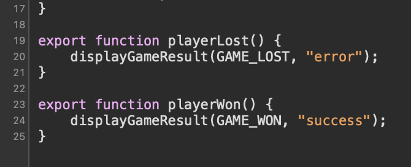
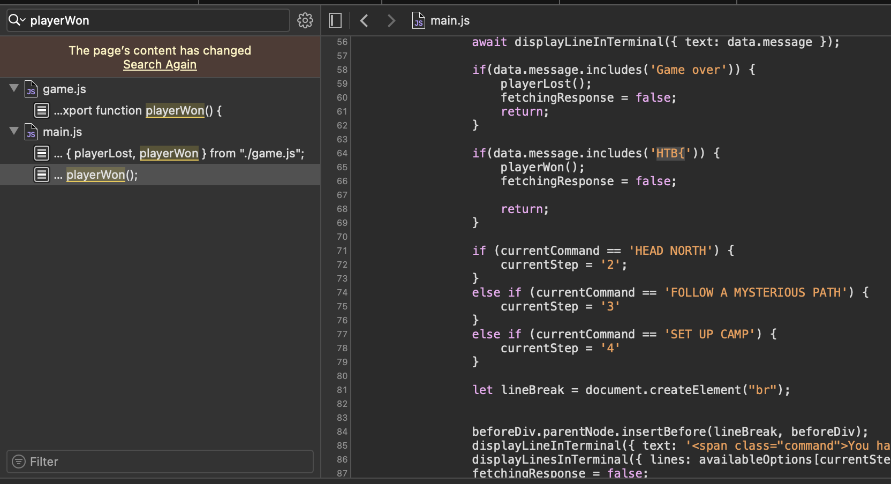
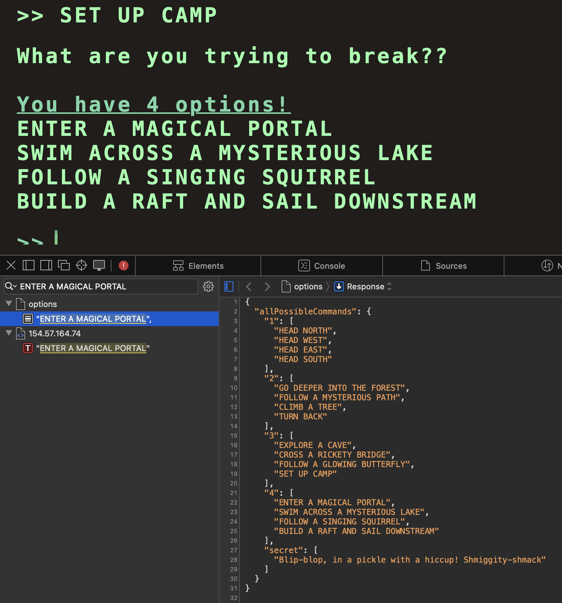
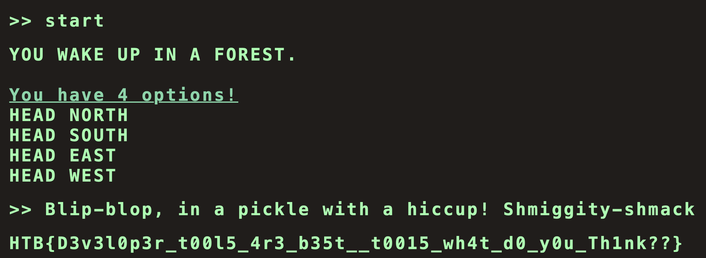

## Introduction

**Challenge Scenario:**
Embark on the "Dimensional Escape Quest" where you wake up in a mysterious forest maze that's not quite of this world. Navigate singing squirrels, mischievous nymphs, and grumpy wizards in a whimsical labyrinth that may lead to otherworldly surprises. Will you conquer the enchanted maze or find yourself lost in a different dimension of magical challenges? The journey unfolds in this mystical escape!

RETIRED Machine

## Solution

The only accepted command to progress is HEAD NORTH. After that, we get 4 choices:
- GO DEEPER INTO THE FOREST
- FOLLOW A MYSTERIOUS PATH
- CLIMB A TREE
- TURN BACK

After choosing the first one, we die.

So we open the browser console and dig into the source code.

We can see in game.js:

We filter the results:

Going through all 4 answers leads to a 5th step where the choices aren't displayed. I picked one of the options and searched for it in the Network tab, where I found a file named "option".

We can see a secret choice, so we try it:

`HTB{D3v3l0p3r_t00l5_4r3_b35t__t0015_wh4t_d0_y0u_Th1nk??}`