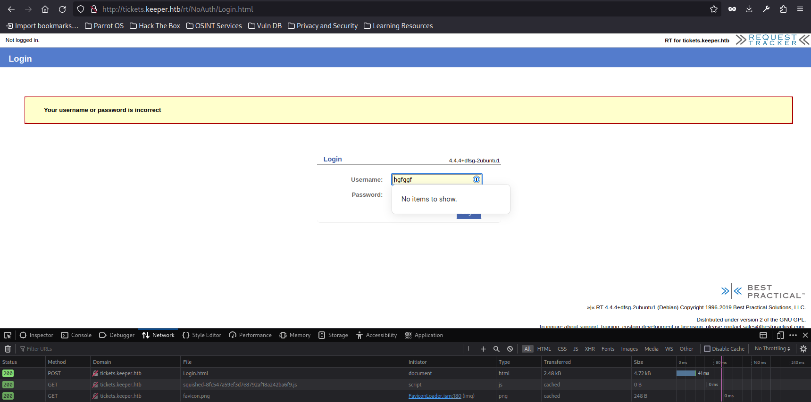
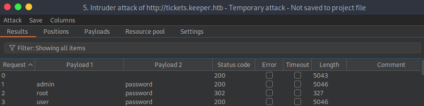
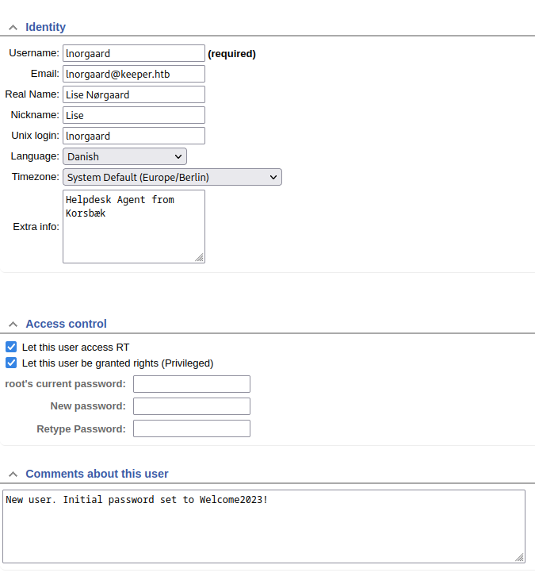
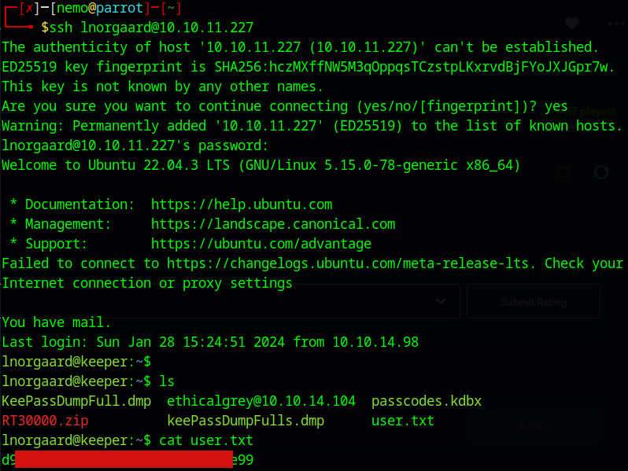
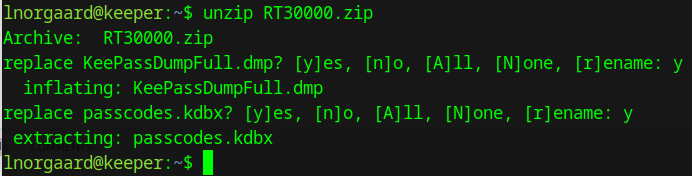
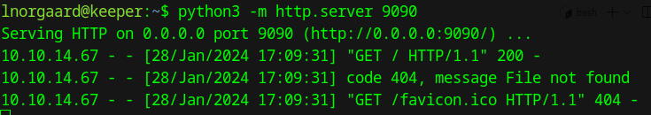
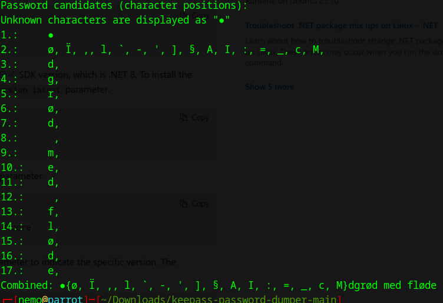
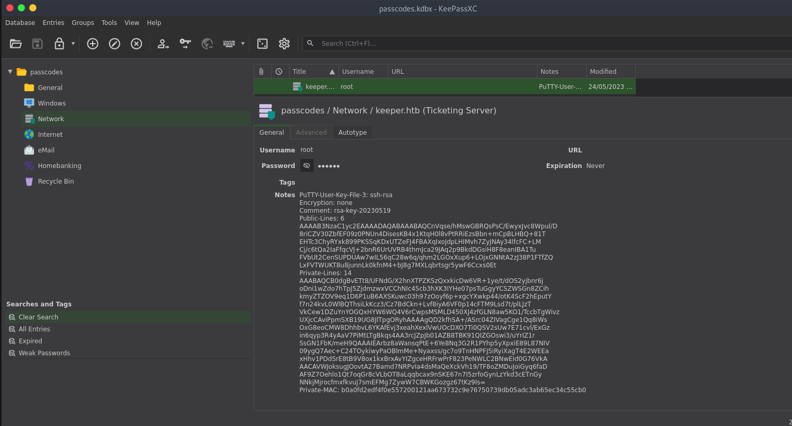
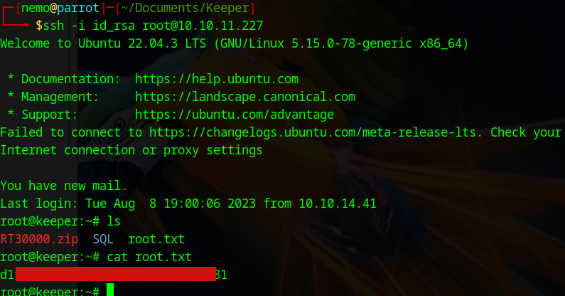

[Link to the machine](https://app.hackthebox.com/machines/Keeper)



Burpsuite -> Send to intruder -> Intruder -> Positions -> Attack type (Cluster bomb)

In the request, highlight the username value and click Add § to mark it as a payload position. Same for the password.

The Payload tab -> Load username txt -> Payload set (2) -> Load pass.txt


<<<<<<< HEAD
=======



```bash
 ssh lnorgaard@10.10.11.227
```



Unzip



Launch python server on ssh session to dl files



Dl the keepassXC dmp.

Download this repository :

https://github.com/vdohney/keepass-password-dumper

Put the dmp file in it.

Install dotnet (7.0), on Debian kernel :

https://learn.microsoft.com/en-us/dotnet/core/install/linux-debian

```bash
 dotnet run KeePassDumpFull.dmp
```



Seems to be a dessert : Rødgrød med fløde

try unlock passcodes.kdbx with **rødgrød med fløde**



Copy the key in txt file.

```bash
 puttygen key.txt -O private-openssh -o id_rsa
```

Connect :

```bash
 ssh -i id_rsa root@10.10.11.227
```


